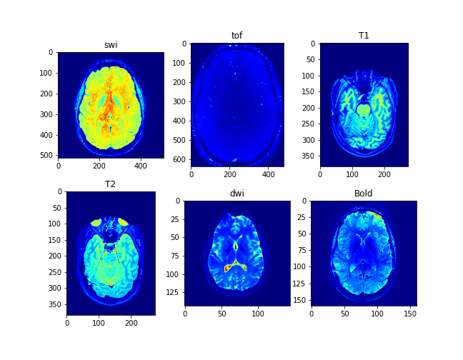
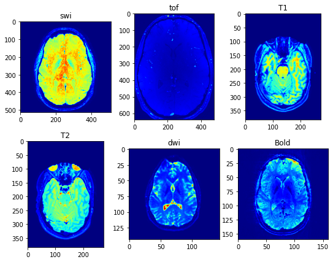

# Medical imaging: Denoising Brain images

#### Magnetic Resonance Imaging (MRI) 
MRI is a non-invasive medical imaging technique that uses strong magnetic fields and radio waves to produce detailed images of internal structures of the body. MRI is widely used in clinical practice to diagnose and monitor various diseases and conditions affecting the brain and other organs.

Different types of MRI sequences are used to visualize different aspects of the brain and other organs. Here, I will briefly discuss some common MRI sequences used to image the brain, including SWI, TOF, T1, T2, DWI, and BOLD.

#### Susceptibility Weighted Imaging (SWI) 
SWI is a type of MRI sequence that is particularly sensitive to changes in the magnetic properties of tissues, such as those caused by the presence of iron or blood products. SWI can help identify small blood vessels, hemorrhages, and other abnormalities in the brain.

#### Time-of-flight (TOF) 
TOF MRI is another type of MRI sequence used to visualize the blood vessels in the brain. TOF is particularly useful in identifying aneurysms and other vascular malformations.

#### T1-weighted and T2-weighted MRI images
T1 and T2 are used to visualize the different types of tissue in the brain, such as gray matter, white matter, and cerebrospinal fluid (CSF). T1-weighted images provide good contrast between gray and white matter, while T2-weighted images are particularly sensitive to edema, inflammation, and other changes in tissue water content.

#### Diffusion-weighted imaging (DWI) 
DWI is a type of MRI sequence that is particularly sensitive to the movement of water molecules in tissues. DWI is commonly used to identify acute ischemic strokes and other conditions affecting the brain.

#### Blood oxygen level-dependent (BOLD)
BOLD imaging is a specialized MRI technique used to visualize changes in the oxygenation of blood in response to neural activity. BOLD imaging is widely used in functional MRI studies to identify the areas of the brain that are activated during different tasks and activities.

#### signal-to-noise ratio (SNR)
One of the major challenges in MRI imaging is the presence of noise, which can degrade the quality of the images and reduce their diagnostic value. The SNR is a measure of the quality of the MRI signal relative to the level of background noise.
 
##### 𝑆𝑁𝑅 = 𝑚𝑒𝑎𝑛(𝑆𝑖𝑔𝑛𝑎𝑙)/𝑠𝑡𝑑(𝑛𝑜𝑖𝑠𝑒)

### Denoising
There are several noise reduction algorithms used in image processing and analysis to remove unwanted noise from an image. Some commonly used noise reduction algorithms include:

##### Median filtering:
This is a non-linear filtering technique that replaces each pixel in the image with the median value of the neighboring pixels. Median filtering is particularly effective at removing impulse noise, such as salt-and-pepper noise.

##### Gaussian filtering: 
This is a linear filtering technique that convolves the image with a Gaussian kernel to smooth out noise and preserve the edges in the image.

##### Wavelet denoising: 
This is a signal processing technique that decomposes the image into different frequency bands using a wavelet transform, and then applies a noise reduction algorithm to each frequency band.

##### Non-local means filtering: 
This is a filtering technique that takes into account the similarity between different image patches when estimating the noise level in the image. Non-local means filtering is particularly effective at removing Gaussian noise.

##### Total variation denoising: 
This is a regularization technique that minimizes the total variation in the image intensity values, while penalizing sharp edges in the image. Total variation denoising is particularly effective at removing noise while preserving image edges and details.

##### Low-rank matrix completion: 
This is a technique that models the noisy image as a low-rank matrix, and then completes the missing values in the matrix using a convex optimization algorithm. This technique is particularly effective at removing noise from images with missing data.

These are just a few examples of the many noise reduction algorithms available in the literature. The choice of algorithm will depend on the specific type of noise present in the image, as well as the desired trade-off between noise reduction and preservation of image details and features.

To improve the quality of MRI images and reduce noise and artifacts, various denoising and artifact removal methods have been developed. One common approach is the Fourier Transform method (FFT), which uses mathematical algorithms to remove noise and other unwanted signals from the MRI data.
Here, I use Fourier transform by 3dguassian filtering for each image. 

In summary, MRI is a powerful imaging technique used to diagnose and monitor various diseases and conditions affecting the brain and other organs. Different types of MRI sequences are used to visualize different aspects of the brain and other tissues. However, the quality of MRI images can be affected by noise and other artifacts, and various methods have been developed to improve image quality and reduce noise and artifacts.
#

### Denoise by nlmeans 

The dipy.denoise.nlmeans.nlmeans method in Python is a non-local means denoising algorithm that is based on the principle of similarity between image patches. The algorithm uses a sliding window approach to estimate the noise level in each patch of the image, and then applies a weighted averaging operation to each patch to reduce the noise.

The non-local means algorithm works by assuming that similar image patches have similar noise levels, and therefore can be averaged together to reduce the noise. In the nlmeans method, the algorithm computes a distance matrix between all pairs of patches in the image, based on the Euclidean distance between their pixel intensity values. The distance matrix is then used to compute a set of weights for each patch, which reflect the similarity between the patch and its neighbors.

Once the weights are computed, the algorithm applies a weighted averaging operation to each patch, where the weight of each neighboring patch is multiplied by its corresponding pixel intensity value, and the resulting products are summed and divided by the total weight of all neighboring patches. This process is repeated for each patch in the image, resulting in a denoised image.

The nlmeans method in dipy.denoise.nlmeans is a Python implementation of the non-local means algorithm, and is designed to be fast and memory-efficient for processing large medical imaging datasets. It supports a range of input data types, including 2D and 3D images, as well as multi-channel images, and can be used to denoise a wide variety of medical imaging modalities, such as MRI and CT.

Overall, the nlmeans method in dipy.denoise.nlmeans provides a powerful and flexible tool for removing noise from medical images, and can be easily incorporated into existing Python workflows for image processing and analysis.

#

### Contrast meseaures

Contrast estimation measures such as contrast entropy, mean root square, and Michelson contrast are not directly related to noise in the image. Instead, these measures are used to quantify the difference in intensity between different regions or structures within the image.

However, the quality of contrast estimation in an image can be affected by the level of noise present in the image. In general, higher levels of noise in the image can reduce the contrast between different regions or structures by increasing the variability in pixel intensity values. This can make it more difficult to accurately estimate contrast using measures such as contrast entropy, mean root square, or Michelson contrast.

To mitigate the impact of noise on contrast estimation, it is important to optimize the image acquisition parameters, such as the signal-to-noise ratio, spatial resolution, and imaging time, to minimize the impact of noise on the image. Additionally, denoising techniques, such as the Fourier Transform method or other noise reduction algorithms, can be applied to the image to remove noise and improve the quality of the image. This can in turn improve the accuracy of contrast estimation measures and enhance the ability to differentiate between different tissues or structures within the image.

#### Contrast entropy 
contrast Entropy is a texture feature that is commonly used in image processing and analysis to quantify the amount of variation in pixel intensity within an image. Specifically, contrast entropy measures the degree of randomness or disorder in the distribution of pixel intensities within a given image.

The formula for contrast entropy is as follows:
##### CE = -∑ p(i) * log2 p(i)

where p(i) represents the probability of a given pixel intensity value occurring within the image, and log2 is the base-2 logarithm function. The entropy value is computed by summing the product of each probability value and its logarithm (in base-2) taken with a negative sign.

In practice, the contrast entropy value can be calculated for an entire image or for specific regions of interest within the image. Higher contrast entropy values indicate greater variability in pixel intensity and thus a greater degree of randomness or disorder within the image. Conversely, lower contrast entropy values indicate a more uniform distribution of pixel intensity values and thus a greater degree of regularity or homogeneity within the image.

Contrast entropy is often used as a feature for image classification, segmentation, and analysis in a variety of applications, including medical imaging, remote sensing, and computer vision. It provides a measure of the complexity and heterogeneity of an image that can be used to differentiate between different types of tissues or structures within the image.

